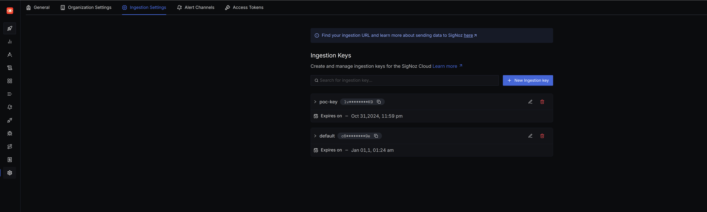

# Summary
This project aims to provide a basic example of how to create an application that monitors certain elements using OpenTelemetry, storing those metrics in **SigNoz**, an open-source software for observability and performance monitoring.

To achieve this, two endpoints have been created, introducing random latencies through sleep and requests that fail 30% of the time to visualize the data in **SigNoz**.

# Prerequisites
## Certificate
Since we will be working with [SigNoz Cloud](https://signoz.io/), we need to download the certificate corresponding to our region, in this case, Europe.
```
openssl s_client -showcerts -connect ingest.eu.signoz.cloud:443 </dev/null 2>/dev/null | openssl x509 -outform PEM > ca-cert.pem
``` 


To view different regions, you can visit the [SigNoz website](https://signoz.io/docs/ingestion/signoz-cloud/overview/).

## Ingestion Key
To ingest data into SigNoz, we need an **Ingestion Key** if using their Cloud service.
To obtain this, navigate to *Settings -> Ingestion Key*.


## Environment Variables
Before running the application, ensure you have set the following environment variables:
- `OTEL_EXPORTER_OTLP_ENDPOINT=<INGEST_ENDPOINT>`
- `SIGNOZ_ACCESS_TOKEN=<YOUR_INGESTION_KEY>`
- `CA_CERT_PATH=<PATH_TO_CERT>`

### Example
```
export OTEL_EXPORTER_OTLP_ENDPOINT=ingest.eu.signoz.cloud:443
export SIGNOZ_ACCESS_TOKEN=<YOUR_INGESTION_KEY>
export CA_CERT_PATH=ca_cert.pem
```

# Test
Now you can test the application using the following endpoints:
- `/add-to-cart`
- `/remove-from-cart`
```
❯ curl localhost:8080/add-to-cart
Item added to cart. Total items: 1                                                                                                                                                            

❯ curl localhost:8080/add-to-cart
Item added to cart. Total items: 2                                                                                                                                                      

❯ curl localhost:8080/add-to-cart
Item added to cart. Total items: 3

❯ curl localhost:8080/add-to-cart
Item added to cart. Total items: 4

❯ curl localhost:8080/add-to-cart
Error adding item to cart

❯ curl localhost:8080/add-to-cart
Item added to cart. Total items: 5

❯ curl localhost:8080/add-to-cart
Error adding item to cart

❯ curl localhost:8080/add-to-cart
Error adding item to cart

❯ curl localhost:8080/add-to-cart
Item added to cart. Total items: 6

❯ curl localhost:8080/add-to-cart
Error adding item to cart

❯ curl localhost:8080/add-to-cart
Item added to cart. Total items: 7

❯ curl localhost:8080/add-to-cart
Item added to cart. Total items: 8

❯ curl localhost:8080/add-to-cart
Error adding item to cart

```